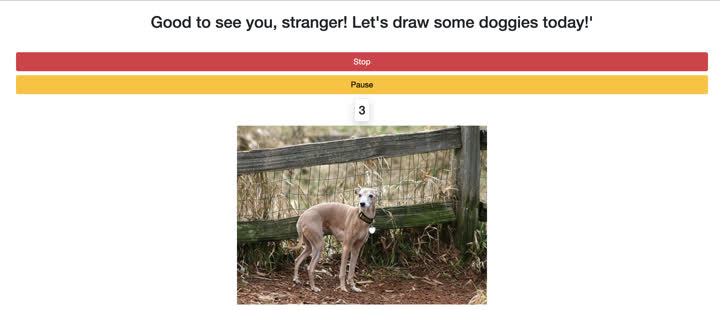

# DoggosSketch
C# web application for artists to sketch dogs daily

This application uses [DogAPI](https://dog.ceo/dog-api/) to grab pictures from
As this is a simple application, I decided not to use any special architecture patterns

This tool could be benefitial for beginner artists who need to sketch daily

Select the breed and desired time interval for sketching

Images will be automatically switched

